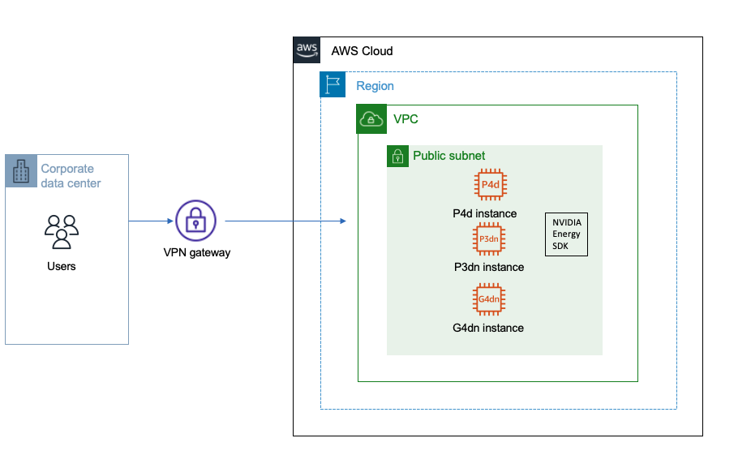

## Kirchhoff Depth and Time Migration from NVIDIA's Energy Samples on AWS

Here we provide instructions to run Kirchhoff Depth and Time Migration from the NVIDIA's Energy Samples on an Amazon EC2 instance.
Figure below shows an AWS architecture diagram to run the appllications 



### Step1 :  Launch a GPU based EC2 instance using [AWS console](https://docs.aws.amazon.com/AWSEC2/latest/UserGuide/EC2_GetStarted.html#ec2-launch-instance) 

* Based on your requirements , number and type of GPUs, launch a GPU based instance, for example g4, p3, p4 on AWS with a public image or any [custom image(AMI)](https://aws.amazon.com/premiumsupport/knowledge-center/launch-instance-custom-ami/) of your choice. 
* Attach a block storage using [Amazon Elastic Block Store (EBS)](https://docs.aws.amazon.com/AWSEC2/latest/UserGuide/ebs-volume-types.html) at the time of launch or select a GPU instance with large local NVMe instance store volumes (like g4d, p3dn or p4d) instances


### Step 2:  Prepare the Launched EC2 instance 


* Once the instance launches, [format and mount the EBS volume](https://docs.aws.amazon.com/AWSEC2/latest/UserGuide/ebs-using-volumes.html) or [local storage](https://docs.aws.amazon.com/AWSEC2/latest/UserGuide/add-instance-store-volumes.html#making-instance-stores-available-on-your-instances) attached to the instance
* Install the latest [NVIDIA drivers](https://www.nvidia.com/Download/index.aspx?lang=en-us) and [CUDA tool kit](https://developer.nvidia.com/cuda-downloads) on the GPU instance
* Install Cmake ( you can either [download binaries](https://cmake.org/download/) or compile cmake source ) on the EC2 instance to be able to build the segyReader utility as well as Kirchhoff Depth and Time Migration applications. (More details in Step 3)


### Step 3:  Building the applications and data reader utility

* Download the NVIDIA Energy SDK samples packages from NVOnline: 
    * <code> Nvidia_EnergySDK_KirchhoffDepthMigration </code>
    * <code> Nvidia_EnergySDK_KirchhoffTimeMigration </code>
    * <code> Nvidia_EnergySDK_DataReaders </code>
* Build the application ( Make sure path to  cmake binary is included in the PATH variable )
    * For example to build Kirchhoff Depth Migration
     ```
      tar -xvzf Nvidia_EnergySDK_KirchhoffDepthMigration_vx_xx.tgz
      mkdir build
      cd build
      cmake ../
      make
     ``` 
    *  This builds the binary kirDepth into the bin directory. To access it <code> ../bin/KirDepth </code>
* Follow similar steps to build Kirchhoff Time Migration
* The  Nvidia_EnergySDK_DataReaders package includes segyReader utility which converts SEG-Y data format into binary format which is the input format required by the applications
    * Build segyReader uitility ( Make sure path to  cmake binary is included in the PATH variable )
       ```
            tar -xvf Nvidia_EnergySDK_DataReaders_vx_x.tgz
            cd segyReader
            mkdir build
            cd build
            cmake ../
            make 
       ```
        * This builds the binary in <code > <path-to>/segyReader/build/bin/segyReader </code>


### Step 4:  Downloading and configuring test datasets 

* Below are the steps to download and configure the  2007 BP Anisotropic Velocity Benchmark dataset (bp_tti to test Kirchhoff Depth Migration)
    
        cd Nvidia_EnergySDK_DataReaders_vx_x
        cd bp_tti
        
        #Multi-part download as the datafiles have been split into smaller files 
        
        wget http://s3.amazonaws.com/open.source.geoscience/open_data/bptti2007/Anisotropic_FD_Model_Shots_part1.sgy.gz 
        wget http://s3.amazonaws.com/open.source.geoscience/open_data/bptti2007/Anisotropic_FD_Model_Shots_part2.sgy.gz
        wget http://s3.amazonaws.com/open.source.geoscience/open_data/bptti2007/Anisotropic_FD_Model_Shots_part3.sgy.gz
        wget http://s3.amazonaws.com/open.source.geoscience/open_data/bptti2007/Anisotropic_FD_Model_Shots_part4.sgy.gz
        wget http://s3.amazonaws.com/open.source.geoscience/open_data/bptti2007/Anisotropic_FD_Model_VSP.tar.gz
        wget http://s3.amazonaws.com/open.source.geoscience/open_data/bptti2007/DatasetInformation_And_Disclaimer.txt
        wget http://s3.amazonaws.com/open.source.geoscience/open_data/bptti2007/ModelParams.tar.gz
        wget http://s3.amazonaws.com/open.source.geoscience/open_data/bptti2007/OtherFiles-2.tar.gz
        wget http://s3.amazonaws.com/open.source.geoscience/open_data/bptti2007/README_Modification.txt
        
        #Decompress the data files
        
        gunzip Anisotropic_FD_Model_Shots_part1.sgy.gz
        gunzip Anisotropic_FD_Model_Shots_part2.sgy.gz
        gunzip Anisotropic_FD_Model_Shots_part3.sgy.gz
        gunzip Anisotropic_FD_Model_Shots_part4.sgy.gz
        gunzip Anisotropic_FD_Model_VSP.tar.gz
        gunzip ModelParams.tar.gz
        tar -xf ModelParams.tar
        gunzip OtherFiles-2.tar.gz
        
        #Convert the data files using segyReader built in step3. Make sure segyReader is included in the PATH variable

         segyReader -in Anisotropic_FD_Model_Shots_part1.sgy -out Anisotropic_FD_Model_Shots
         segyReader -in Anisotropic_FD_Model_Shots_part2.sgy -out Anisotropic_FD_Model_Shots -add
         segyReader -in Anisotropic_FD_Model_Shots_part3.sgy -out Anisotropic_FD_Model_Shots -add
         segyReader -in Anisotropic_FD_Model_Shots_part4.sgy -out Anisotropic_FD_Model_Shots -add

         cd ModelParams
         segyReader -in Vp_Model.sgy -out Vp_Model
         segyReader -in Delta_Model.sgy -out Delta_Model
         segyReader -in Epsilon_Model.sgy -out Epsilon_Model
         segyReader -in Theta_Model.sgy -out Theta_Model

         #Convert velocity model to 3D

         ../mult.sh Vp_Model.data
         ../mult.sh Delta_Model.data
         ../mult.sh Epsilon_Model.data
         ../mult.sh Theta_Model.data

         #Fixup the Geometry files

         gunzip Anisotropic_FD_Model_Shots.geom.gz
         gunzip ModelParams/Phi_Model.data.gz


* Follow similar steps to download and configure 2004 BP Velocity Estimation Benchmark dataset (bp2d to run Kirchhoff Time Migration)
* Once the datasets are configured, move the configured input data into the localstorage/EBS volume attached on the instance that was formatted and mounted in Step2. 


### Step 5:  Running the applications 


* Choose the data set to run the application. For example bp_tti for Kirchhoff Depth Migration or bp2d for Time Migration.
* The applications can be run using the following commands
    ```
    cd <dataset>
    <path-to>/kirDepth parfile= <path-to>/parfile.krdm
    <path-to>/kirTepth parfile= <path-to>/parfile.krtm
   
* There is a sample parameter file ( parfile ) included in each dataset. This parameter file can be customized to best suit your workload. The file defines key parameters used for running the model such as number of GPUs, number of traces etc. 
* The applications output the imaging time/migration time measured in addition to a few other measured parameters such as travel time/compute time. You can also check the GPU utilization while the application is running.
